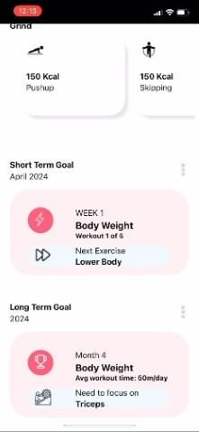

# JimFit: A Smart Workout App

JimFit is a Cross-Platform Mobile Application (PWA) designed to analyze and provide feedback on a user’s posture during push-up exercises. Utilizing modern web technologies and machine learning models, JimFit ensures proper workout form, preventing injuries and enhancing exercise efficiency.

## Project Overview

JimFit was developed using React, TensorFlow.js, and Google’s MoveNet model to process real-time video feeds. The application uses the webcam to extract body coordinates and evaluate posture. By ensuring the correct posture, it helps users perform push-ups safely and effectively.

### Key Features

- **Real-Time Posture Analysis:** Analyzes user posture during exercises (example: push-up), and provides corrective suggestions.
- **Push-Up Counter:** Counts correctly performed reps based on posture validation.
- **Privacy-Focused:** Process video locally on the user's device to ensure privacy.
- **Cross-Platform Compatibility:** Built as a PWA, usable across iOS, and Andoid devices without app store restrictions.
- **Intuitive Design:** Simple and user-friendly interface for seamless interaction.

## Technology Stack

- **Frontend:** React, JavaScript, HTML, CSS
- **Machine Learning:** TensorFlow.js and MoveNet (Thunder version)
- **PWA Framework:** Google’s Workbox

## How It Works

JimFit uses the webcam to capture a real-time video feed of the user during their workout. This video is processed locally on the user’s device using TensorFlow.js, ensuring both privacy and performance. The app employs Google’s MoveNet model to extract the coordinates of key body joints such as the shoulders, elbows, wrists, hips, knees, and ankles. These coordinates are then used to calculate angles and distances that help determine the user’s posture.

For posture detection during push-up, the system evaluates the angles of the user’s shoulder, hip, knee, and ankle joints. If the alignment falls within a specified range (170-190 degrees), the posture is deemed correct. Otherwise, the app provides feedback to correct the alignment.

The push-up counting mechanism works by monitoring the relative distance between the shoulder and wrist. A push-up is counted when the user’s posture remains correct, and the motion follows the defined pattern: the distance decreases by at least 70% during the descent and returns to 90% during the ascent. This ensures only proper push-ups are added to the count.

Additionally, JimFit continuously monitors the user’s body alignment across the shoulder, hip, knee, and ankle to ensure the body remains straight throughout the exercise. If any misalignment is detected, the app provides real-time feedback to help the user maintain the correct form.

The combination of precise angle calculations, real-time feedback, and motion tracking makes JimFit an effective tool for ensuring safe and accurate push-up exercises. Currently the application can help users with practising push-ups with support more exercises coming soon.

## Architecture


#### <center> Architecture-Pushup </center>

## Demo
<div align="center">
  
  
  <h3>Homepage</h3>
  
  
  <h3>Correct and Incorrect pushup scenario</h3>
</div>


## Installation

1. Clone the repository:
   ```bash
   git clone https://github.com/sriramsridhar26/JimFit-PWA.git
   ```
2. Navigate to the project directory:
   ```bash
   cd JimFit-PWA
   ```
3. Install dependencies:
   ```bash
   npm install
   ```
4. Start the development server:
   ```bash
   npm start
   ```
5. Open the app in your browser at `http://localhost:3000`.

## Experimental Setup

- **Devices Tested:** iPhone 12.
- **User Testing:** Conducted with individuals of varying body types, and fitness levels to validate accuracy.


## Challenges and Solutions

- **Ensuring User Privacy:** Addressed by processing video locally instead of sending it to a backend server.
- **Performance Constraints:** Optimized TensorFlow.js operations for real-time feedback.
- **Outdated Documentation:** Overcame issues with outdated TensorFlow.js APIs by referring to Google’s demo projects.

## Future Scope

- Extend posture analysis to additional exercises.
- Integrate RxDB to perform fatigue analysis for providing suggestion when they're tired, and couldn't perform exercise efficiently.
- Improve performance with WebGPU for iOS once it's supported on Safari.

## Learning Outcomes

This project offered significant learning opportunities, including:
- Developing Progressive Web Applications with React.
- Integrating machine learning models in frontend development.
- Balancing real-time performance with user privacy concerns.

## Contact

For any inquiries or feedback, please contact:
- **Sriram Sridhar**: [sriramsridhar01@gmail.com](mailto:sriramsridhar01@gmail.com)
